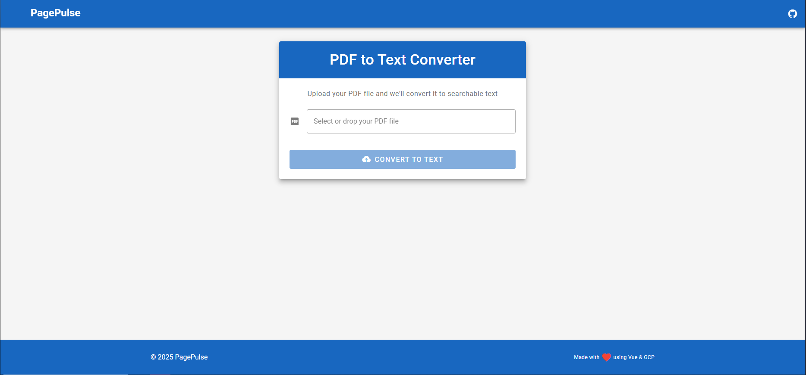

# PagePulse: Cloud-Native PDF to Text Converter

A modern, cloud-native application that converts PDF files to searchable text using Google Cloud Platform services. Built with Vue.js, FastAPI, and GCP services.



## Features

- 📄 Upload and convert PDF files to searchable text
- ☁️ Cloud-native architecture using GCP services
- 🚀 Scalable processing with Kubernetes
- 📊 Real-time conversion status updates
- 🎯 Modern, responsive UI with Vue.js and Vuetify
- 🔄 Asynchronous processing with Pub/Sub
- 📦 Containerized workloads for portability

## Architecture

### Components
- **Frontend**: Vue.js 3 + Vuetify 3 web application
- **Backend API**: FastAPI application running on GKE
- **Storage**: Google Cloud Storage for PDFs and text files
- **Processing**: Cloud Functions for PDF conversion
- **Messaging**: Cloud Pub/Sub for async communication
- **Infrastructure**: Terraform (optional) for IaC

### Flow
1. User uploads PDF via web UI
2. Backend validates and stores PDF in Cloud Storage
3. Pub/Sub message triggers conversion process
4. Cloud Function converts PDF to text
5. Frontend polls for completion status
6. User downloads converted text file

## Local Development

### Prerequisites
- Node.js 16+
- Python 3.8+
- Google Cloud SDK
- Docker
- kubectl

### Frontend Setup
```bash
cd frontend
npm install
npm run dev
```

### Backend Setup
```bash
cd backend
python -m venv venv
source venv/bin/activate  # or `venv\Scripts\activate` on Windows
pip install -r requirements.txt
uvicorn main:app --reload
```

### Cloud Function Setup
```bash
cd cloud-functions/pdf-converter
pip install -r requirements.txt
functions-framework --target=convert_pdf_to_text
```

## File Storage

- **PDFs and Text Files:** Currently, uploaded PDFs and converted text files are stored locally in the backend directories:
  - PDFs: `backend/uploads/`
  - Text files: `backend/conversions/`
- **Cloud Storage:** The Cloud Function is configured to optionally save converted text files to a GCS bucket (`pagepulse-pdf-bucket`). However, the backend currently uses local storage.

## Deployment

### Google Cloud Setup
1. Create a new GCP project
2. Enable required APIs:
   - Cloud Storage
   - Cloud Functions
   - Cloud Pub/Sub
   - Kubernetes Engine
3. Create service accounts and download credentials

### Infrastructure Deployment with Terraform
1. Navigate to the terraform directory:
   ```bash
   cd terraform
   ```
2. Initialize Terraform:
   ```bash
   terraform init
   ```
3. Apply the Terraform configuration:
   ```bash
   terraform apply
   ```
   This will create:
   - VPC and subnet
   - Cloud Storage bucket (`pagepulse-pdf-bucket`)
   - Pub/Sub topic (`pdf-conversion-topic`)
   - Cloud Function (`pdf-converter`)
   - VM instance (`pagepulse-app-server`)

### Deploy Backend to GKE
1. Navigate to the kubernetes directory:
   ```bash
   cd kubernetes
   ```
2. Apply the Kubernetes manifests:
   ```bash
   kubectl apply -f deployment.yaml
   kubectl apply -f service.yaml
   ```

### Deploy Frontend to VM
1. Build the frontend:
   ```bash
   cd frontend
   npm install
   npm run build
   ```
2. Upload the `dist` folder to the VM and configure Nginx to serve it.

## Performance Testing with Locust

1. Install Locust:
   ```bash
   pip install locust
   ```
2. Navigate to the project root and run Locust:
   ```bash
   locust -f locustfile.py
   ```
3. Open `http://localhost:8089` in your browser.
4. Configure the test:
   - Number of users: 10
   - Spawn rate: 1
   - Host: `http://<backend-external-ip>`
5. Start the test and collect results (charts, logs, screenshots).

## Cost Analysis

Estimated monthly cost: $87.67
- GKE: $74.26 (1 zonal cluster with e2-small node)
- Compute Engine VM: $6.11 (e2-micro instance)
- Cloud Functions: $1.85 (512 MiB memory, 1M requests/month)
- Storage: $5.46 (10 GiB disk)

## Contributing

1. Fork the repository
2. Create your feature branch
3. Commit your changes
4. Push to the branch
5. Create a Pull Request

## License

This project is licensed under the MIT License - see the LICENSE file for details.

## Acknowledgments

- Built with Vue.js & GCP
- PDF processing using PyPDF2
- UI components from Vuetify
- Cloud architecture inspired by GCP best practices
